# Real World Asset (RWA) for Concordium

## Terms

### Marketplace Owner (MO)

We assume that MO should know the law, work with a legal entity, and follow the latest changes in that particular legislation. MO is responsible for

* providing technical infrastructure including the marketplace,
* ID attributes verifier,
* contract initiations for specific types,
* adding compliance rules for specific countries,
* or even tokens, etc.
* and one of the biggest duties is following compliance rules of the asset type he is selling.

### Marketplace Legal Partner (MLP)

They have to follow the latest regulations for this type of asset,
it is their responsibility to define compliance rules and
they are the escrow that holds the custody of real-world assets.
MLP should also provide an off-chain custody service, which will basically get the asset i.e. house, from the owner by signing some papers and in return will let him tokenize his asset,
verify the asset status on chain (since it is minted unverified by default),
and set the maximum fractions that can be created after it.

### Asset Owner Person (AOP)

Any person or enterprise should be able to tokenize their assets. A person, who wants to tokenize his asset also should be fulfilling some criteria to hold that token type.
He/She has to provide identity attributes and
even should be able to show proof of having a license from a trusted entity if its required for the asset type.

Since any token can have any compliance rules applied,

* We first check the IP’s eligibility with his ID attributes and
* Again if the token requires having a license, in a separate process we will have to wait a proof generated for AOP, that says they are eligible.

In that sense, there could be 2 separate processes simultaneously to be able to verify an AOP’s eligibility to hold the token. If he is, then MO adds AOP’s public address to a smart contract instance in a whitelisting array.

### Asset Owner Enterprise (AOE)

An enterprise, by default, doesn’t hold ID credentials other than the LEI number in its ID object. Id requirements are not applicable, and we need to be able to differentiate them by simply asking to reveal their ID from UI. If AOE wants to tokenize the asset, they have to have a license in other words all of their legal permits should be controlled by a trusted entity, and a verifiable credential should be issued to their identity.

### Investor Person (IP)

Any investor can buy these tokens either from MO’s marketplace or directly from any user. We have to make sure that, they have certified to hold these assets. **That’s the biggest problem we need to solve.**

In order to get this token, we need to make sure this IP is in a special whitelist contract created for the token. To get that list, IP has to complete two paths that need to be checked for the token, first,

* IP will share his ID attributes (the ones that are required for the specific token type and defined the MO)
* and if the token requires a license contract will check if he has a VC issued by the trusted entity for this IP, and

if both satisfied IP will get registered to whitelisted accounts list. From now on, he can hold this token.

### Investor Enterprise (IE)

If a company wants to hold an RWA token, there will be different verification requirements that possibly have to be applied. Could be a Crypto Asset Service Provider (CASP) license or something else. The trusted entity will issue a VC for the IE and if this exists, IE can invest.

### Trusted Entity (TE)

MO will have to assign trusted entities for the issuance of VCs for license-required occasions.

It is TE’s job to check everything off-chain for an individual or organization and if they are providing the required qualification, they will issue the VC.

```mermaid
sequenceDiagram
actor MO as Marketplace Owner (MO)
actor AO as RWA Owner (AO)
actor MLP as Marketplace Legal Partner (MLP)
participant CIS2 as Security Token Contract (STC) <br/> Represents a single token type
participant TIR as Trusted Identity Registry (TIR)

rect rgb(60, 60, 0)
note right of MO: Token Holder Addition
MO ->> CIS2 : Add Trusted Identity Registry
MO ->> TIR : Add Trusted Entity (MLP), Role = Minter
AO -->> +MO : Verify KYC & Documents
MO -->> MO : Document Verification
MO ->> -TIR : Add AO Role=Holder
end 

rect rgb(80, 60, 0)
note right of AO: Token Minting Process
AO -->> MLP : RWA custody for Car1
MLP -->> MLP : Document Verification
MLP ->> +CIS2 : Mint Token Car1 Owner = AO, Fractions = n
CIS2 ->> +TIR : Is MLP Verified Minter?
TIR ->> -CIS2 : Yes MLP is Verified Minter
CIS2 ->> +TIR : Is AO Verified Holder ?
TIR ->> -CIS2 : Yes AO is Verified Holder
CIS2 ->> -CIS2 : Adds a new Token Car1 Owner=AO
AO -->> CIS2 : `BalanceOf(AO, Car1) = 1`
end

rect rgb(60, 60, 0)
note right of MO: Fractionalizer Setup
create participant Frac as Fractionalized Token Contract (Frac)
MO ->> Frac : Init
MO ->> Frac : Add Trusted Token Contract STC
MO ->> TIR : Add STC role=holder
end

rect rgb(60, 30, 0)
note right of AO: Fractionalizing Process
AO ->> +CIS2 : Add Frac as Operator
AO ->> +Frac : Fractionalize Car1
Frac ->> Frac : IS Trusted STC
Frac ->> CIS2 : Transfer me Car1 from AO
CIS2 ->> TIR : Is Frac Verified Holder
TIR ->> CIS2 : Yes Frac is a Verified Holder
CIS2 ->> CIS2 : Assigns Car1 to Frac
CIS2 ->> -Frac : You now own all the n Fractions of Car1
Frac ->> -Frac : Mints n Amount of Car1 tokens, owner=AO
end 
AO -->> Frac : `BalanceOf(AO, Car1) = n`
alt P2P Transfer
    rect rgb(60, 30, 60)
    note right of AO: Token Transfer P2P
    AO ->> +Frac : Transfer x Car1 tokens to AO1
    Frac ->> CIS2 : Give me your TIR Address
    CIS2 ->> Frac : Address of TIR
    Frac ->> TIR : is AO2 verified holder?
    TIR ->> Frac : Yes AO2 is verified
    destroy Frac
    Frac ->> -Frac : Transfers x Car1 tokens to AO1
    end
else Burning Fractions
    rect rgb(60, 30, 60)
    note right of AO: Burning Fractions
    AO ->> +Frac : Burn n Car1 tokens
    Frac ->> Frac : Burn Tokens
    destroy Frac
    Frac ->> -CIS2 : Transfer Car1 Token to AO
    end
end

rect rgb(60, 60, 0)
note right of MO: Marketplace Setup
create participant Marketplace as Marketplace
MO ->> Marketplace : Init
MO ->> Marketplace : Add Trusted STC
MO ->> TIR : Add Marketplace role=holder
end

rect rgb(60, 30, 0)
note right of AO: Selling Process (Listing)
AO ->> +CIS2 : Add Marketplace as Operator
AO ->> +Marketplace : Sell Token Car1 for x CCD
Marketplace ->> Marketplace : Is Valid STC?
Marketplace ->> CIS2 : Transfer Token Car1 to Me
CIS2 ->> TIR : Is Marketplace a valid Holder
TIR ->> CIS2 : Yes Marketplace is a valid holder
CIS2 ->> CIS2 : Transfer Car1 to Marketplace
CIS2 ->> Marketplace : You own Car1
Marketplace ->> -Marketplace : List Car1 for x CCD
end
```

