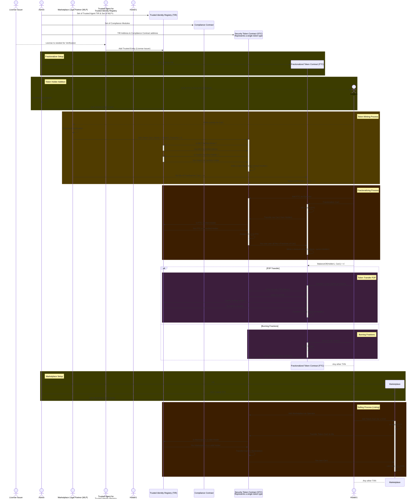

# Concordium RWA Token Flow

```mermaid
sequenceDiagram;
    actor Govt as LIcense Issuer
    actor MO as Admin;
    actor MLP as Marketplace Legal Partner (MLP);
    actor TaTir as Trusted Agent for <br/> Trusted Identity Registry
    actor AO2 as Holder1;

    create participant TIR as Trusted Identity Registry (TIR);
    MO ->> TIR : Set of Trusted Agent TIR & Set of MLP's
    create participant ComC as Compliance Contract
    MO ->> ComC : Set of Compliance Modules
    create participant CIS2 as Security Token Contract (STC) <br/> Represents a single token type;
    MO ->> CIS2 : TIR Address & Compliance Contract address

    Govt -->> TaTir : License Is needed for Verification
    TaTir ->> TIR : Add Trusted Entity (License Issuer)

    rect rgb(60, 60, 0);
    note right of MO: Fractionalizer Setup;
    create participant FTC as Fractionalized Token Contract (FTC);
    MO ->> FTC : STC, MLP & TIR;
    MO ->> TIR : Add STC role=holder;
    end;

    rect rgb(60, 60, 0);
    note right of MO: Token Holder Addition;
    create actor Holder1 as Holder1
    MO -->> Holder1 : Verify KYC & Documents Request;
    MO -->> MO : Document Verification;
    MO ->> TIR : Add Holder1 Role=Holder;
    end;

    rect rgb(80, 60, 0);
    note right of Holder1: Token Minting Process;
    Holder1 -->> MLP : RWA custody for Car1;
    MLP -->> MLP : Document Verification;
    MLP ->> +CIS2 : Mint Token Car1 Owner = Holder1, Fractions = n;
    CIS2 ->> +TIR : Is MLP Verified Minter?;
    TIR ->> -CIS2 : Yes MLP is Verified Minter;
    CIS2 ->> +TIR : Is Holder1 Verified Holder ?;
    TIR ->> -CIS2 : Yes Holder1 is Verified Holder;
    CIS2 ->> -CIS2 : Adds a new Token Car1 Owner=Holder1;
    MLP ->> FTC : Set No of Fractions for Car1 = n
    Holder1 -->> CIS2 : `BalanceOf(Holder1, Car1) = 1`;
    end;


    rect rgb(60, 30, 0);
    note right of Holder1: Fractionalizing Process;
    Holder1 ->> +CIS2 : Add FTC as Operator;
    Holder1 ->> +FTC : Fractionalize Car1;
    FTC ->> FTC : IS Trusted STC;
    FTC ->> CIS2 : Transfer me Car1 from Holder1;
    CIS2 ->> TIR : Is FTC Verified Holder;
    TIR ->> CIS2 : Yes FTC is a Verified Holder;
    CIS2 ->> CIS2 : Assigns Car1 to FTC;
    CIS2 ->> -FTC : You now own all the n Fractions of Car1;
    FTC ->> -FTC : Mints n Amount of Car1 tokens, owner=Holder1;
    end ;
    Holder1 -->> FTC : `BalanceOf(Holder1, Car1) = n`;
    alt P2P Transfer;
        rect rgb(60, 30, 60);
        note right of Holder1: Token Transfer P2P;
        Holder1 ->> +FTC : Transfer x Car1 tokens to Holder1;
        FTC ->> CIS2 : Give me your TIR Address;
        CIS2 ->> FTC : Address of TIR;
        FTC ->> TIR : is AO2 verified holder?;
        TIR ->> FTC : Yes AO2 is verified;
        FTC ->> -FTC : Transfers x Car1 tokens to Holder1;
        end;
    else Burning Fractions;
        rect rgb(60, 30, 60);
        note right of Holder1: Burning Fractions;
        Holder1 ->> +FTC : Burn n Car1 tokens;
        FTC ->> FTC : Burn Tokens;
        FTC ->> -CIS2 : Transfer Car1 Token to Holder1;
        end;
    end;
    destroy FTC
    Holder1 --> FTC : Any other TXN

    rect rgb(60, 60, 0);
    note right of MO: Marketplace Setup;
    create participant Marketplace as Marketplace;
    MO ->> Marketplace : Init;
    MO ->> Marketplace : Add Trusted STC;
    MO ->> TIR : Add Marketplace role=holder;
    end;

    rect rgb(60, 30, 0);
    note right of Holder1: Selling Process (Listing);
    Holder1 ->> +CIS2 : Add Marketplace as Operator;
    Holder1 ->> +Marketplace : Sell Token Car1 for x CCD;
    Marketplace ->> Marketplace : Is Valid STC?;
    Marketplace ->> CIS2 : Transfer Token Car1 to Me;
    CIS2 ->> TIR : Is Marketplace a valid Holder;
    TIR ->> CIS2 : Yes Marketplace is a valid holder;
    CIS2 ->> CIS2 : Transfer Car1 to Marketplace;
    CIS2 ->> Marketplace : You own Car1;
    Marketplace ->> -Marketplace : List Car1 for x CCD;
    end;

    destroy Marketplace
    Holder1 --> Marketplace : Any other TXN
```
