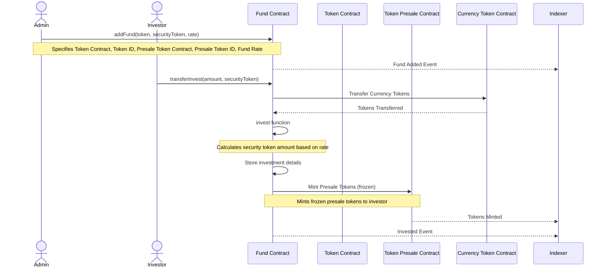
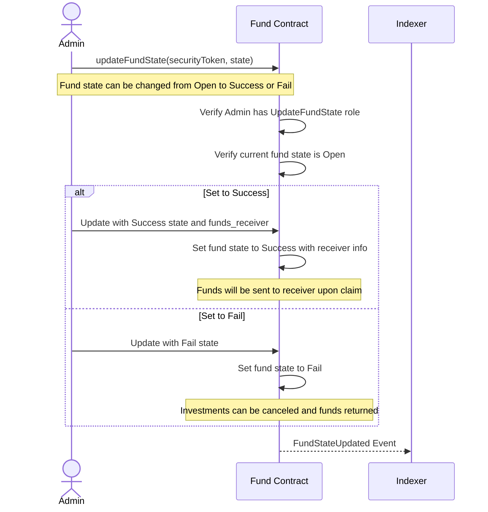
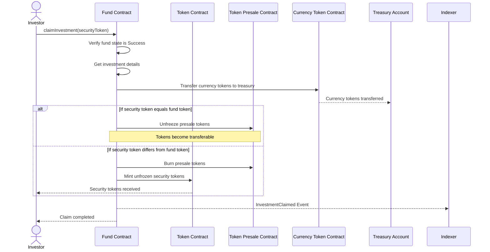
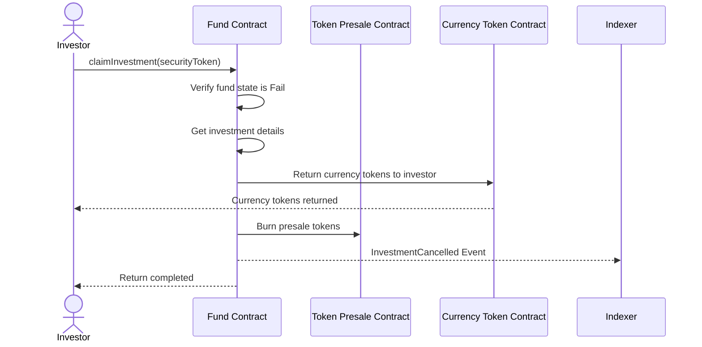

# Security-Mint-Fund Contract Sequence Diagrams

## Fund Initialization and Investment Process

This diagram illustrates the primary workflow of the security-mint-fund contract:

1. Admin initializes a fund by specifying token details and conversion rate
2. Investors can transfer currency tokens to invest in the fund
3. The fund contract calculates the equivalent token amount using the rate
4. Presale tokens are minted to the investor in a frozen state
5. All events are sent to the Indexer for off-chain processing and monitoring

Additional operations like claiming investments, cancelling investments, and updating fund state are available as shown in the contract code.

## Fund State Update Process

This diagram shows how an admin with the UpdateFundState role can update a fund's state:

1. Admin calls updateFundState with the security token ID and new state
2. The contract verifies the admin has proper permissions
3. The contract checks the fund is in Open state (can't update from Success or Fail)
4. Fund state is updated to either Success (with funds receiver) or Fail
5. The state change event is sent to the Indexer
6. Based on the new state, investors can either claim tokens (Success) or cancel investments (Fail)

## Investment Claiming Process (Fund Success)

This diagram shows the process when an investor claims their investment after fund success:

1. Investor or authorized operator calls claimInvestment with the security token details
2. The contract verifies the fund is in "Success" state
3. The invested currency tokens are transferred to the treasury account (specified during fund state update)
4. Depending on token configuration:
   - If the security token equals the fund token: presale tokens are simply unfrozen
   - Otherwise: presale tokens are burned and new unfrozen security tokens are minted to the investor
5. An InvestmentClaimed event is sent to the Indexer

## Investment Return Process (Fund Fail)

This diagram shows the process when an investor claims their investment after fund failure:

1. Investor or authorized operator calls claimInvestment with the security token details
2. The contract verifies the fund is in "Fail" state
3. The invested currency tokens are returned to the original investor
4. The presale tokens are burned
5. An InvestmentCancelled event is sent to the Indexer
