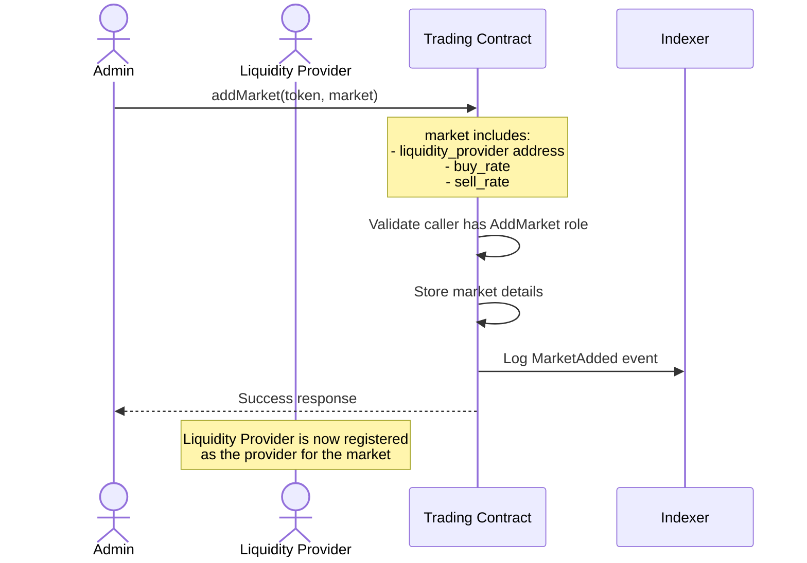
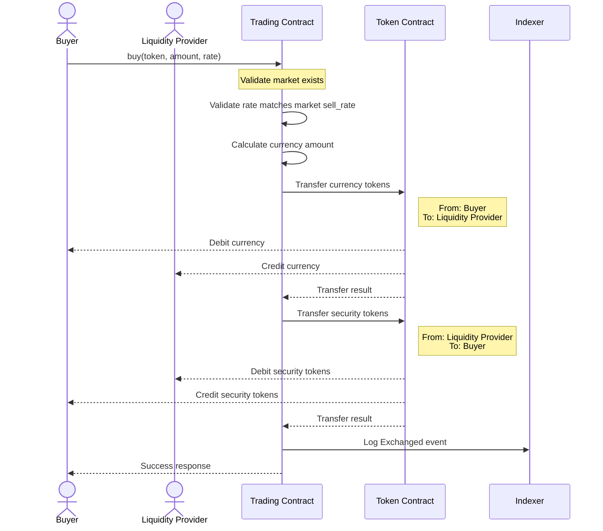
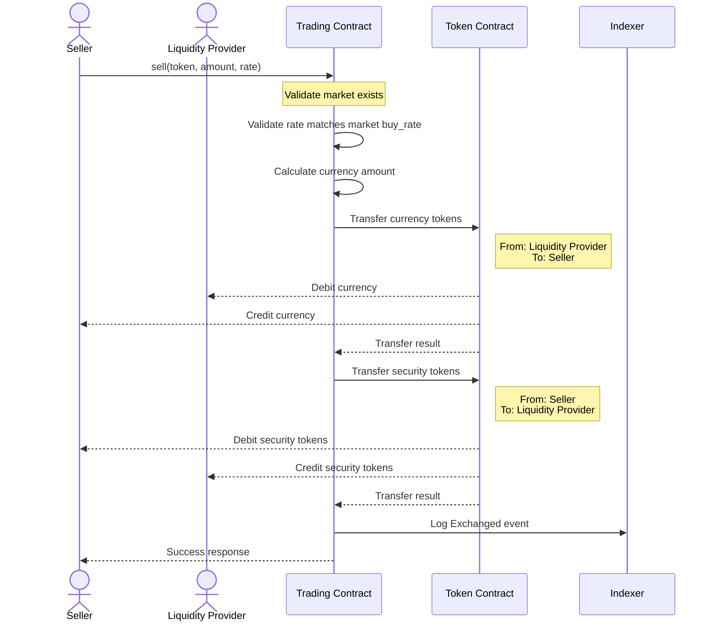

# Security P2P Trading Contract - Sequence Diagrams

This document provides sequence diagrams illustrating the key interactions within the P2P Trading smart contract.

## Contract Participants

- **Admin**: Manages markets and agent permissions
- **Buyer**: Purchases security tokens from liquidity providers
- **Seller**: Sells security tokens to liquidity providers
- **Liquidity Provider**: Provides liquidity for both tokens and currency
- **Trading Contract**: Core contract managing markets and facilitating trades
- **Token Contract**: Handles token transfers (both security and currency tokens)
- **Indexer**: Records events emitted by the contract

## Market Initialization

This diagram illustrates the market initialization process:

1. An admin with the AddMarket role calls the addMarket function with token details and market parameters
2. The contract validates that the caller has the appropriate permission
3. The market details are stored in the contract state, including liquidity provider address and buy/sell rates
4. A MarketAdded event is emitted to the Indexer for off-chain tracking
5. The liquidity provider is now registered as the provider for this specific security token market

## Buy Operation

This diagram depicts the token buying process:

1. A buyer calls the buy function with security token address, desired amount, and expected rate
2. The contract validates that the requested market exists and the rate matches the market's sell_rate
3. The required currency amount is calculated based on the token amount and rate
4. Currency tokens are transferred from the buyer to the liquidity provider
5. Security tokens are transferred from the liquidity provider to the buyer
6. An Exchanged event is emitted to the Indexer with details of the transaction
7. The operation is completed with a success response to the buyer

## Sell Operation

This diagram illustrates the token selling process:

1. A seller calls the sell function with security token address, amount to sell, and expected rate
2. The contract validates that the requested market exists and the rate matches the market's buy_rate
3. The currency amount to be received is calculated based on the token amount and rate
4. Currency tokens are transferred from the liquidity provider to the seller
5. Security tokens are transferred from the seller to the liquidity provider
6. An Exchanged event is emitted to the Indexer with details of the transaction
7. The operation is completed with a success response to the seller
