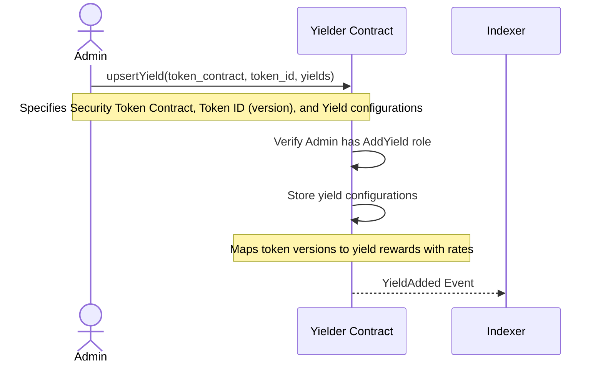
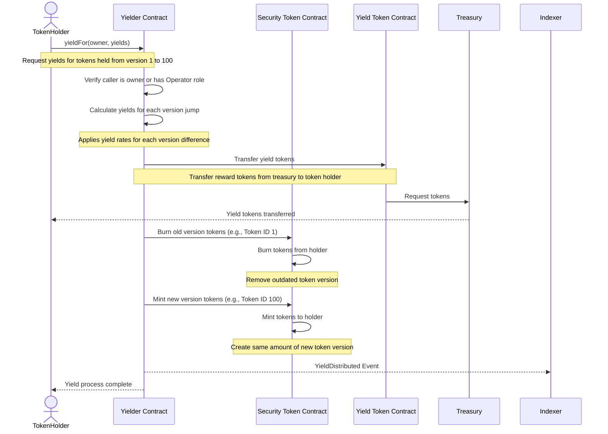

# Security-SFT-Multi-Yielder Contract Sequence Diagrams

## Adding Yield Configuration Process

## Token Holder Claiming Yields Process

These diagrams illustrate the key workflows in the security-sft-multi-yielder contract:

1. **Adding Yields**: Admins configure which yields (rewards) are available for specific token versions
2. **Claiming Yields**: Token holders receive rewards and upgrade their tokens to newer versions

The process enables token holders to receive rewards for holding security tokens over time, with the rewards calculated based on token amount and holding duration.
